# 🏭DEFECTLENS
### **AI-Powered Visual Quality Inspection & Predictive Maintenance Platform**
#### *See the defect. Trace the evidence. Protect production.*

<p>
  
  
  
  
  
</p>

> **A smarter inspection workflow for modern automotive manufacturing.**  
> DefectLens brings visual defect detection, machine-health analysis, quality analytics, and evidence-informed maintenance support into one cohesive platform.

</div>

---

## 🧭 The DefectLens Mission

Manufacturing quality is not a single checkpoint. It is a continuous story told by product surfaces, inspection records, machine conditions, and maintenance decisions.

**DefectLens** is an academic project concept for AI-assisted automotive inspection. Its architecture combines a React.js interface, a Java/Spring Boot application backend, a PostgreSQL data layer, and Python-based AI/ML components. The goal is to help teams organise inspection findings, review potential defects, explore quality trends, and investigate equipment-health signals.

### 🎬 At a glance

| 🔎 Focus | 🎯 What DefectLens aims to support |
|---|---|
| Visual quality | Analyse product images for model-supported defect detections |
| Explainable review | Present labels, confidence scores, and available detection evidence |
| Quality intelligence | Explore defect counts and inspection trends from stored records |
| Machine health | Review available temperature, vibration, RPM, pressure, and torque readings |
| Predictive maintenance | Explore risk estimates when suitable data and validated models exist |
| Root-cause support | Connect relevant records and present possible contributing factors |
| Maintenance guidance | Surface evidence-informed suggestions for qualified human review |

> ⚠️ **Reality check:** This README describes the intended architecture and proposed workflows. A library, page, model, endpoint, or deployment mentioned here should only be described as implemented after it has been built and verified in the repository.

---

## 🗺️ Table of Contents

- [01 — The Challenge](#-01--the-challenge)
- [02 — Project Vision and Objectives](#-02--project-vision-and-objectives)
- [03 — The Proposed Solution](#-03--the-proposed-solution)
- [04 — Technology Stack](#-04--technology-stack)
- [05 — Cinematic System Architecture](#-05--cinematic-system-architecture)
- [06 — End-to-End Journey](#-06--end-to-end-journey)
- [07 — Visual Inspection Pipeline](#-07--visual-inspection-pipeline)
- [08 — AI/ML Engine](#-08--aiml-engine)
- [09 — Defect Intelligence Catalogue](#-09--defect-intelligence-catalogue)
- [10 — Machine Health and Predictive Maintenance](#-10--machine-health-and-predictive-maintenance)
- [11 — Root-Cause Investigation](#-11--root-cause-investigation)
- [12 — Maintenance Recommendation Workflow](#-12--maintenance-recommendation-workflow)
- [13 — Application Modules](#-13--application-modules)
- [14 — Proposed Database Model](#-14--proposed-database-model)
- [15 — Backend and API Contract](#-15--backend-and-api-contract)
- [16 — Frontend Experience](#-16--frontend-experience)
- [17 — Data Lifecycle](#-17--data-lifecycle)
- [18 — Security and Responsible AI](#-18--security-and-responsible-ai)
- [19 — Repository Structure](#-19--repository-structure)
- [20 — Local Setup](#-20--local-setup)
- [21 — Environment Configuration](#-21--environment-configuration)
- [22 — Running the Services](#-22--running-the-services)
- [23 — Testing and Quality Gates](#-23--testing-and-quality-gates)
- [24 — Model Evaluation](#-24--model-evaluation)
- [25 — Deployment Blueprint](#-25--deployment-blueprint)
- [26 — Error Handling and Observability](#-26--error-handling-and-observability)
- [27 — Known Constraints](#-27--known-constraints)
- [28 — Future Roadmap](#-28--future-roadmap)
- [29 — Team and Acknowledgement](#-29--team-and-acknowledgement)
- [30 — Contribution Workflow](#-30--contribution-workflow)
- [31 — Final Word](#-31--final-word)

---

## 🧩 01 — The Challenge

Automotive components must meet demanding quality expectations. Surface defects may be subtle, repetitive inspections can consume time, and equipment issues may emerge gradually before causing production disruption.

A disconnected workflow can create several practical difficulties:

- 👁️ **Inspection inconsistency:** Human inspection may vary with lighting, fatigue, experience, and inspection conditions.
- 🧾 **Fragmented records:** Images, inspection outcomes, machine readings, and maintenance notes may be stored separately.
- ⏳ **Slow investigation:** Teams may need to search multiple sources to understand a quality event.
- 📉 **Limited trend visibility:** Without structured historical data, recurring defect patterns can be hard to spot.
- 🛠️ **Reactive maintenance:** Equipment problems may be addressed only after a warning or failure occurs.
- 🧠 **Hard-to-interpret results:** A raw model prediction is not enough; users need context and supporting evidence.

### 🔥 The central problem

> How can a single software platform help inspection and maintenance teams review visual defects, understand available evidence, and make better-informed decisions—without pretending that AI is infallible?

### 🧭 Problem-to-capability map

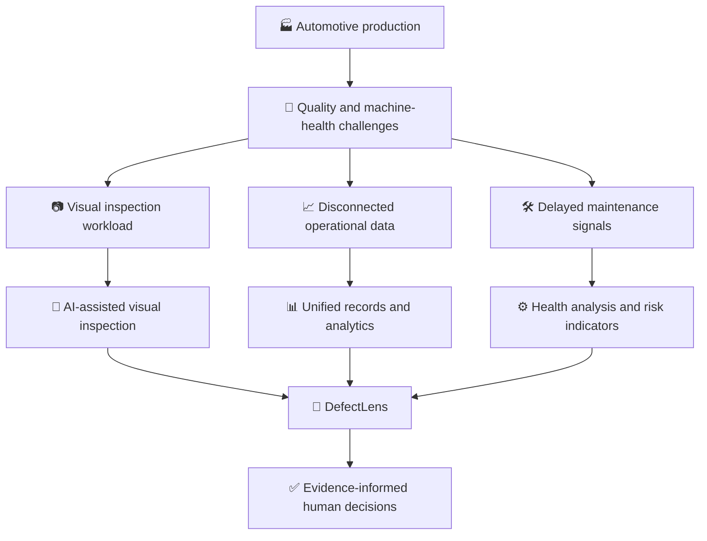

---

## 🎯 02 — Project Vision and Objectives

### 🌟 Vision

Build a modular platform that connects visual inspection, application data, AI/ML analysis, and a clear dashboard experience.

### 🎯 Objectives

1. Create a modern web interface for inspection and analysis workflows.
2. Accept supported product images and validate uploads safely.
3. Connect the application to a configured computer-vision model.
4. Present detections in a readable, structured format.
5. Store inspection metadata and results in PostgreSQL when persistence is configured.
6. Display quality analytics based on actual records.
7. Support analysis of available machine-health parameters.
8. Explore predictive-maintenance methods when relevant historical data exists.
9. Help users investigate possible causes using related evidence.
10. Present maintenance suggestions with clear caveats and human review.
11. Keep frontend, backend, database, and AI/ML components modular.
12. Make the project testable, maintainable, and suitable for academic demonstration.

### 🏁 What success should mean

| Success area | Evidence to collect |
|---|---|
| Usability | Users can complete the implemented inspection workflow |
| Reliability | Invalid inputs and unavailable services are handled safely |
| Detection | Model results are measured on a held-out dataset |
| Data integrity | Stored records can be retrieved and linked correctly |
| Analytics | Dashboard figures agree with the underlying data |
| Maintainability | Services have documented configuration and repeatable setup |
| Transparency | Predictions and limitations are clearly communicated |

Do not claim a success metric until the team has measured it.

---

## 💡 03 — The Proposed Solution

DefectLens is planned around four cooperating areas.

### 🖥️ A. Frontend — React.js

The frontend provides the visual workspace. Tailwind CSS supports styling, while Recharts is used for charts. It should communicate the state of each workflow clearly: ready, processing, complete, empty, or failed.

### 🔌 B. Application backend — Java and Spring Boot

Spring Boot coordinates application requests, validates inputs, handles data access, and integrates with the AI/ML service where that integration exists. REST APIs define the boundary between the web interface and server-side functionality.

### 🧠 C. AI/ML services — Python

Python hosts the image-analysis and machine-learning code. The stack shown in the project architecture includes PyTorch, YOLO, OpenCV, scikit-learn, Pandas, NumPy, and FastAPI.

### 🗄️ D. Data and AI assistance

PostgreSQL is the relational database. Supabase appears in the current technology-stack slide as a possible managed PostgreSQL platform. Google Gemini API is listed for generative-AI assistance, subject to secure server-side configuration.

### 🧱 Responsibility boundaries

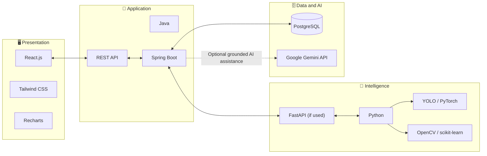

---

## 🧰 04 — Technology Stack

This section follows the current stack shown in the user's architecture slide. The final implementation should be checked against the repository and the team's actual decisions.

### 🎨 Frontend stack

| Technology | Role | Why it belongs |
|---|---|---|
| **React.js** | UI library | Builds reusable components and page-level workflows |
| **Tailwind CSS** | Styling | Supports consistent, responsive interface design |
| **Recharts** | Visualisation | Displays charts for quality and production analytics |

### ⚙️ Backend stack

| Technology | Role | Why it belongs |
|---|---|---|
| **Java** | Backend language | Implements server-side application logic |
| **Spring Boot** | Application framework | Provides configuration, dependency management, and web-service support |
| **REST APIs** | Integration pattern | Defines structured request/response communication |

### 🧠 AI/ML stack

| Technology | Role | Why it belongs |
|---|---|---|
| **Python** | AI/ML language | Common ecosystem for data science and model inference |
| **FastAPI** | Python API framework | Can expose inference functionality through HTTP endpoints |
| **PyTorch** | Deep-learning framework | Supports model development and inference |
| **YOLO** | Object-detection family | Can detect labelled objects or defects when trained/configured for them |
| **OpenCV** | Computer vision | Supports image decoding, transformation, and processing |
| **scikit-learn** | Traditional machine learning | Supports preprocessing, baselines, and tabular prediction |
| **Pandas** | Data analysis | Loads, cleans, and transforms tabular records |
| **NumPy** | Numerical computing | Provides arrays and numerical operations |

### 🗃️ Data stack

| Technology | Role | Important note |
|---|---|---|
| **PostgreSQL** | Relational database | Primary relational database in the architecture |
| **Supabase** | Managed platform option shown in the slide | Supabase uses PostgreSQL; it is not a second database engine |

### ✨ Generative AI

| Technology | Role | Important note |
|---|---|---|
| **Google Gemini API** | Optional language-model assistance | Keep the key server-side; ground summaries in actual inspection data |

### 🚀 DevOps and deployment

| Technology | Role | Important note |
|---|---|---|
| **Docker** | Containerisation option | Use only if the team has decided to package services in containers |
| **Git** | Version control | Tracks source changes and supports branching |
| **GitHub** | Repository and collaboration | Hosts code, issues, and pull requests; it is not itself the application runtime |
| **Vercel** | Frontend deployment option | Often suitable for the React/Vite frontend |
| **Render** | Deployment option shown in the slide | Verify runtime support and configuration for each service |

### 🔗 Technology interaction map

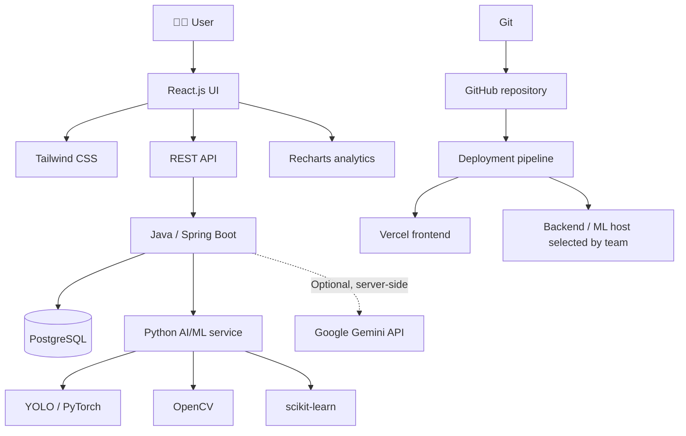

### ⚠️ Stack consistency checklist

- PostgreSQL is the database engine; Supabase is a platform option around PostgreSQL.
- GitHub should appear as source-code collaboration, not as a duplicate deployment service.
- The architecture slide lists both Vercel and Render. Confirm which service is deployed where before documenting live URLs.
- The presence of Docker in the slide does not mean Docker is mandatory or already configured.
- Temperature, vibration, RPM, pressure, and torque should be called **available readings or sample data** unless actual sensor ingestion is implemented.
- Do not expose Gemini API keys through variables prefixed with `VITE_`.

---

## 🏗️ 05 — Cinematic System Architecture

The system architecture describes how a product image can travel from the user interface through application orchestration and model inference, then return as a structured result. A separate machine-health path can process operational measurements when they are available.

### 🧭 Main architecture

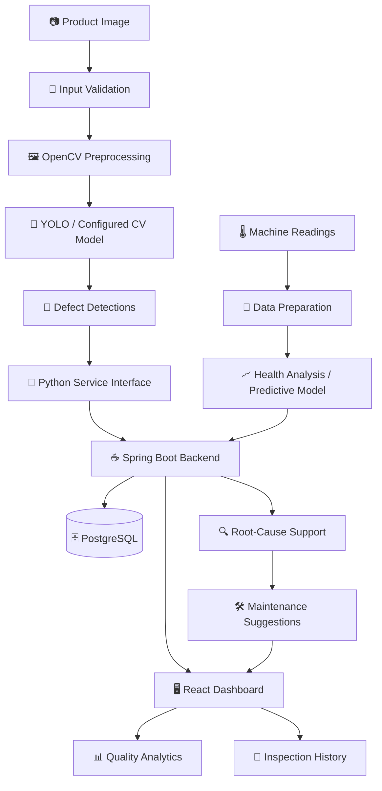

### 🧩 Architecture layer map

| Layer | Input | Responsibility | Output |
|---|---|---|---|
| User interface | User action and files | Guides the workflow | Validated request |
| Spring Boot backend | HTTP request | Validation, orchestration, persistence | Structured response |
| Python AI/ML | Image or tabular features | Inference or analysis | Model output |
| PostgreSQL | Validated records | Persistent structured data | Query results |
| Analytics UI | API data | Visual summaries | Charts and tables |
| Optional Gemini integration | Grounded context | Language-based explanation | Generated text for review |

### 🔁 Service communication

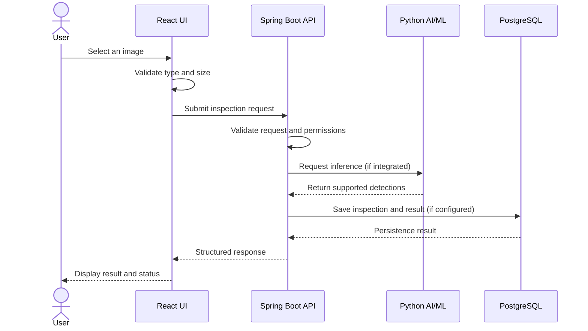

> 📝 This sequence is the intended interaction pattern. Exact routes, payloads, authentication, and persistence behaviour must match the actual implementation.

---

## 🚦 06 — End-to-End Journey

A good product workflow should feel clear even when a service fails. DefectLens should show the user what is happening and what they can do next.

### 🪄 Inspection journey

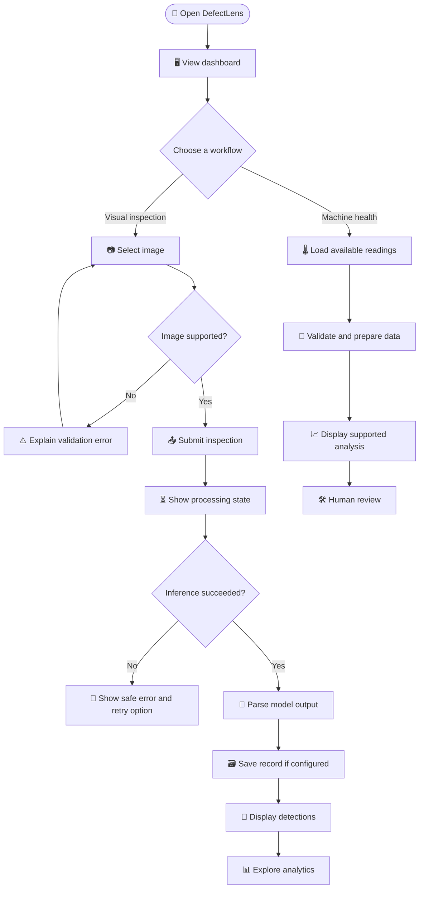

### 🧑‍🔧 User journey stages

1. **Discover:** The user opens the dashboard and selects a workflow.
2. **Submit:** The user provides an image or available machine-health data.
3. **Validate:** The application checks required fields and supported inputs.
4. **Analyse:** The configured model or analysis service processes the input.
5. **Interpret:** The application converts the result into a consistent display format.
6. **Record:** The backend stores results if persistence is configured.
7. **Review:** The user examines detections, trends, and supporting evidence.
8. **Act responsibly:** A qualified person decides whether further inspection or maintenance is needed.

### 🎛️ States the interface should support

| State | User-facing behaviour |
|---|---|
| Ready | Explain what input is required |
| Uploading | Show progress where available |
| Processing | Explain that analysis is in progress |
| Success | Present actual returned data |
| Empty | Explain that no records or readings are available |
| Validation error | Identify the input issue |
| Service error | Explain the failure without leaking internals |
| Timeout | Offer a safe retry path where appropriate |

---

## 📷 07 — Visual Inspection Pipeline

The visual-inspection path starts with a product image and ends with model-supported findings.

### 🧪 Pipeline diagram

```mermaid
flowchart LR
    A["📷 Image"] --> B["🔒 Validate file"]
    B --> C["🧹 Decode and preprocess"]
    C --> D["📐 Resize / normalise as model requires"]
    D --> E["🧠 Run configured detector"]
    E --> F["🎯 Parse boxes, labels, scores"]
    F --> G["🧹 Filter and validate detections"]
    G --> H["🧾 Build structured result"]
    H --> I["🔌 Return through backend"]
    I --> J["🖥️ Render result"]
```

### 🧹 Step 1 — Validate the input

The application should check that an upload:
- Is present when required.
- Has an allowed file type.
- Is within configured size limits.
- Can be decoded as an image.
- Does not rely solely on a user-supplied filename or MIME type.

### 🖼️ Step 2 — Preprocess the image

Preprocessing must match the model's training and inference configuration. It may include resizing, colour-space conversion, normalisation, or other transformations. Incorrect preprocessing can make an otherwise good model perform poorly.

### 🎯 Step 3 — Run detection

The model returns only the outputs it is designed to produce. A YOLO detector commonly returns boxes, class identifiers, and confidence values. Segmentation masks or defect measurements should only be displayed if the selected model actually supplies them.

### 🧾 Step 4 — Standardise the response

A useful conceptual response shape is:

```json
{
  "inspectionId": "example-id",
  "status": "completed",
  "model": {
    "name": "configured-model",
    "version": "configured-version"
  },
  "detections": [
    {
      "label": "example-defect-class",
      "confidence": 0.91,
      "box": {
        "x": 120,
        "y": 80,
        "width": 64,
        "height": 42
      }
    }
  ]
}
```

This is an **illustrative schema only**. Replace it with the response actually returned by the project's model service. The sample values are not a claim about real model accuracy or detections.

### 🧯 Step 5 — Handle inference failures

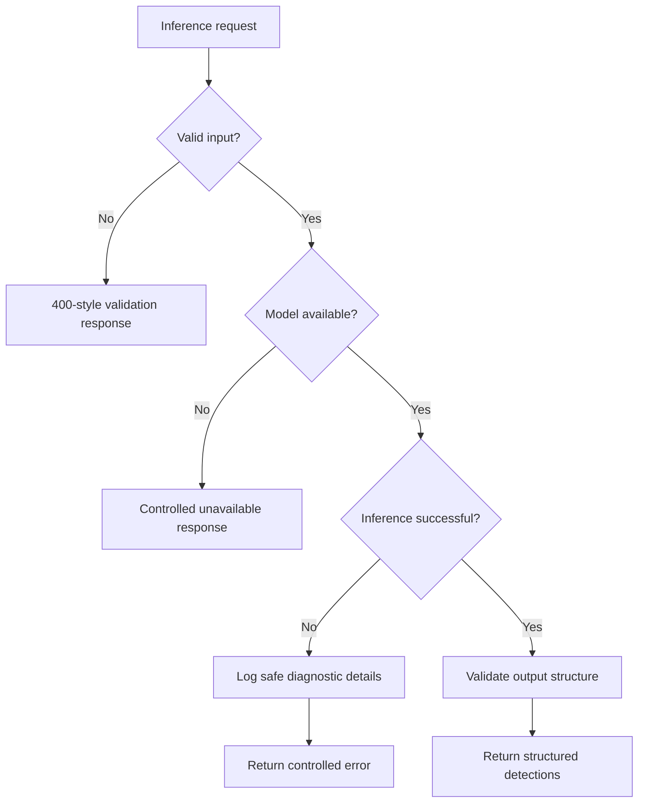

---

## 🧠 08 — AI/ML Engine

The AI/ML layer is responsible for turning supported input data into structured analysis. Different tasks may need different algorithms; a visual detector and a machine-health predictor are not interchangeable.

### 🧰 Library responsibilities

| Library | Intended use |
|---|---|
| Python | AI/ML implementation language |
| OpenCV | Image loading and processing |
| YOLO | Detection of classes learned by the configured model |
| PyTorch | Deep-learning model execution and development |
| scikit-learn | Classical ML, preprocessing, and evaluation utilities |
| Pandas | Tabular-data cleaning and analysis |
| NumPy | Numerical operations and arrays |
| FastAPI | Optional HTTP boundary for Python inference |

### 🧬 AI/ML pipeline

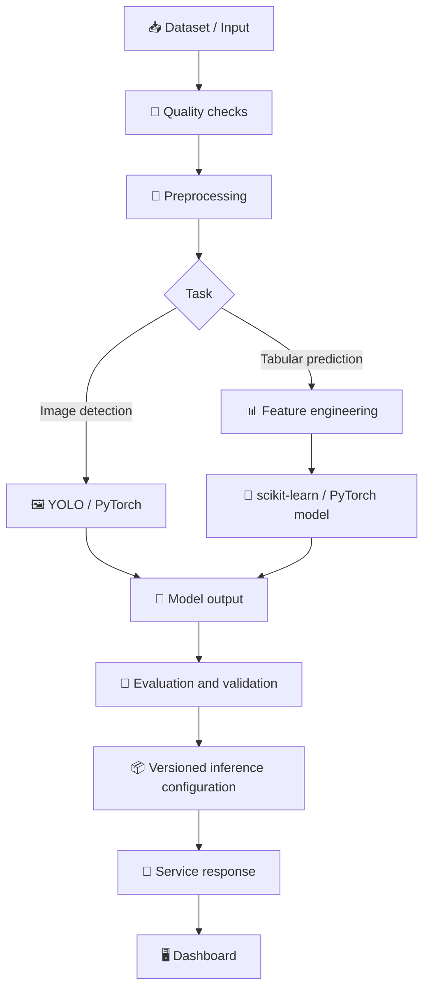

### 🧪 Training versus inference

- **Training** learns model parameters from a labelled dataset.
- **Validation** helps select settings and identify overfitting.
- **Testing** estimates performance on held-out data.
- **Inference** applies the selected model to a new input.
- **Monitoring** checks whether real-world inputs or outputs change over time.

A model file and an inference endpoint are not the same thing. The application needs a configured model, preprocessing pipeline, class mapping, runtime dependencies, and a stable output contract.

### 🧷 Model metadata

Where practical, retain:
- Model name and version.
- Class-label mapping.
- Input dimensions and preprocessing settings.
- Confidence threshold.
- Dataset/version reference.
- Evaluation date and metrics.
- Runtime version and known limitations.

### ⚖️ Explainability and confidence

A confidence score is a model score, not a guaranteed probability that a defect exists. The interface should avoid implying certainty. A bounding box identifies where a detector responded; it does not independently prove the engineering cause or severity of a defect.

---

## 🏷️ 09 — Defect Intelligence Catalogue

The categories below are **candidate categories** for an automotive defect dataset. Actual support depends on the labels present in the training data and the configured model.

| 🔍 Candidate class | What it may represent | Important challenge |
|---|---|---|
| Paint scratch | A visible scratch or abrasion | Reflections and fine marks can be difficult to distinguish |
| Dent | Localised surface deformation | Shadows can resemble shape changes |
| Surface crack | A visible crack line | Small cracks require suitable resolution and labels |
| Missing bolt | A missing expected fastener | The relevant component and viewing angle matter |
| Weld defect | Visible irregularity in a weld region | Defect definitions need consistent annotation |
| Rust spot | Corrosion-like surface change | Dirt and lighting can produce similar appearances |
| Panel misalignment | Misalignment between adjacent panels | May require contextual or geometric comparison |

### 🧭 Defect-review workflow

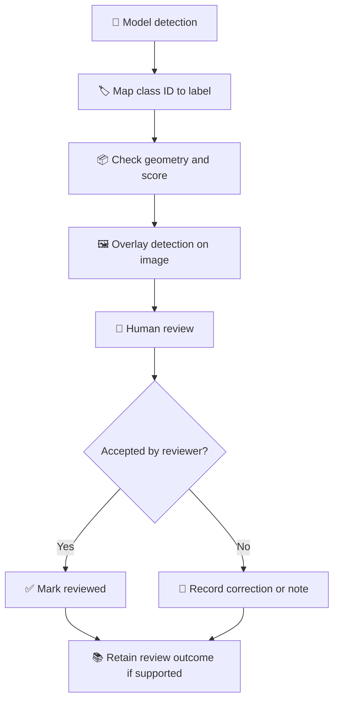

### 📋 Suggested inspection record

A record may include:
- Unique inspection identifier.
- Image reference.
- Date and time.
- Component or product identifier, if supplied.
- Predicted class and confidence.
- Bounding-box coordinates, if available.
- Model/version metadata.
- Review state and notes, if implemented.

### 🛑 Avoid overclaiming

Do not describe a category as supported just because it appears in this README. Verify the actual model's class list and test examples. If a class is not trained or configured, the application cannot reliably detect it.

---

## 🌡️ 10 — Machine Health and Predictive Maintenance

The system architecture slide shows the following example operating parameters:

- 🌡️ Temperature
- 📳 Vibration
- 🔄 RPM
- 💨 Pressure
- 🔧 Torque

These parameters can help describe machine condition, but their interpretation depends on the equipment type, sensor specifications, operating mode, and measurement units. DefectLens should only analyse data that is actually available to the application.

### 🧭 Machine-health workflow

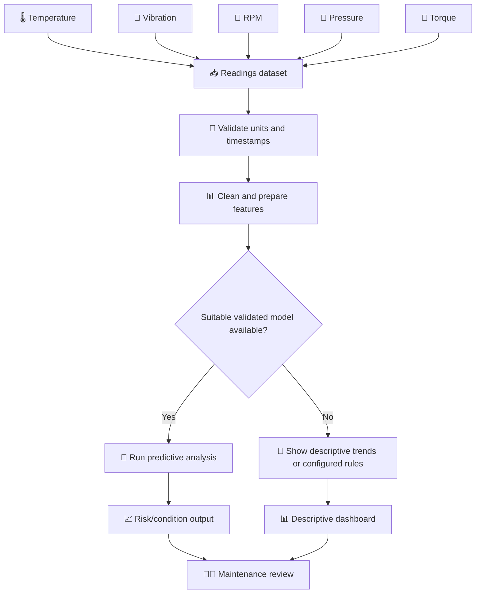

### 📊 Data requirements

| Requirement | Why it matters |
|---|---|
| Timestamp | Allows readings to be ordered and compared |
| Machine identifier | Prevents unrelated equipment readings from being mixed |
| Measurement units | Makes values interpretable |
| Sampling interval | Determines what temporal patterns can be detected |
| Operating state | Helps distinguish normal operating changes from anomalies |
| Failure/maintenance labels | May be necessary for supervised prediction |
| Missing-data handling | Prevents silent errors during preprocessing |

### 🧠 Prediction versus monitoring

| Approach | What it can support | What it cannot prove alone |
|---|---|---|
| Descriptive trend | Shows how readings change | Does not predict a failure by itself |
| Threshold rule | Flags a configured condition | Does not prove the machine will fail |
| Anomaly detection | Identifies unusual patterns | Does not automatically identify the cause |
| Supervised prediction | Estimates a target learned from labelled data | Is not reliable without representative validation |

### 🧪 Predictive-maintenance evaluation

If labelled historical data exists, evaluate the model with a split that respects time and machine identity where appropriate. Consider precision, recall, false-alarm rate, missed-event rate, lead time, and calibration. Overall accuracy alone can hide poor performance when failures are rare.

If suitable data is not available, the project can still demonstrate data validation, trends, and rule-based alerts—clearly labelled as such.

---

## 🔍 11 — Root-Cause Investigation

Root-cause analysis is an investigation aid. It should present possible contributing factors with evidence and uncertainty rather than claim to discover a definitive cause from a single image.

### 🔗 Evidence correlation

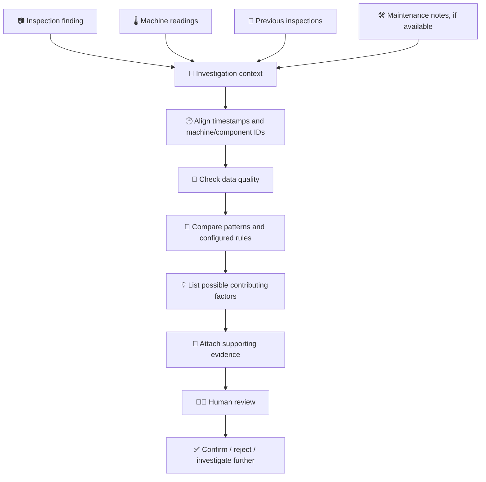

### 🧾 Evidence classes

| Evidence class | Example | How it should be presented |
|---|---|---|
| Observed input | A submitted image or recorded measurement | As an input record |
| Model output | A detected label and score | As a prediction |
| Historical association | Similar findings occurred near a reading change | As a correlation requiring review |
| Rule result | A configured threshold was crossed | As a rule-triggered flag |
| Possible cause | A hypothesis suggested by evidence | As a hypothesis, not a fact |
| Confirmed cause | An outcome verified by qualified investigation | Only when confirmation is actually recorded |

### 🧠 Optional generative-AI assistance

The Google Gemini API appears in the stack. If integrated, it may help summarise verified inspection records or organise possible explanations. The application should provide relevant context, avoid sending unnecessary sensitive data, validate output, and label generated text clearly.

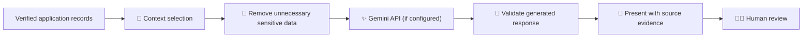

---

## 🛠️ 12 — Maintenance Recommendation Workflow

Recommendations should be connected to the finding or data pattern that motivated them.

### 🧭 Recommendation lifecycle

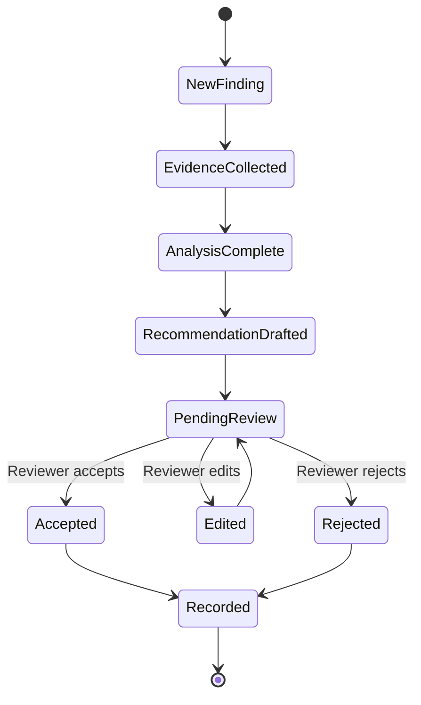

### 🧰 Recommendation structure

A proposed recommendation can contain:

| Field | Purpose |
|---|---|
| Finding reference | Links the recommendation to an inspection or machine event |
| Evidence summary | Explains what data triggered the suggestion |
| Suggested action | Gives the proposed follow-up |
| Priority | Uses a documented priority policy, if implemented |
| Source | Identifies a rule, model, or generated summary |
| Review status | Tracks human review where supported |
| Timestamp | Records when the recommendation was created |

### ⚠️ Safety boundary

Recommendations should never instruct a user to bypass safety procedures. Equipment shutdowns, repairs, and safety-critical actions must follow the organisation's approved procedures and be decided by authorised personnel.

---

## 🖥️ 13 — Application Modules

The following module descriptions define the intended product areas. Keep the final list aligned with the pages and functions present in the code.

### 🏠 13.1 Dashboard

**Purpose:** Give users a quick overview of available inspection and machine-health information.

Possible dashboard cards:
- Total inspections in the selected period.
- Defect categories based on actual detections.
- Recent inspection activity.
- Available machine-health indicators.
- Data freshness or service status.

**Design rule:** A missing value should be shown as unavailable, not silently replaced with a fabricated metric.

### 📷 13.2 New Inspection

**Purpose:** Guide the user through submitting a supported image.

Expected interface states:
- File not selected.
- File selected and validated.
- Upload or processing in progress.
- Results returned.
- Validation or service error.

### 🎯 13.3 Inspection Results

**Purpose:** Present the model output in a readable and reviewable format.

Possible elements:
- Original image.
- Detection overlay if supported.
- Defect label.
- Confidence score.
- Bounding-box coordinates.
- Model metadata.
- Review notes, if implemented.

### 🗂️ 13.4 Inspection History

**Purpose:** Help users find prior inspections.

Potential controls:
- Search by inspection or component identifier.
- Filter by date or status.
- Filter by returned defect category.
- Sort by timestamp.
- Open an inspection's detail view.

Only provide filters that are supported by the API and underlying data.

### 📊 13.5 Quality Analytics

**Purpose:** Summarise actual inspection records with Recharts.

Potential views:
- Detections by class.
- Inspection outcomes over time.
- Counts by selected time period.
- Comparison of categories.

Analytics should document the time range, filters, and data source behind each chart.

### 🌡️ 13.6 Machine Health

**Purpose:** Review available operating measurements.

Potential elements:
- Measurement value and unit.
- Timestamp and machine identifier.
- Trend chart.
- Configured threshold.
- Missing-data message.
- Model/rule output with explanation.

### 🏭 13.7 Production Analytics

**Purpose:** Present production metrics if those records are available.

Do not create artificial production counts, downtime savings, defect-reduction percentages, or other KPIs merely to fill a dashboard.

### 🧾 13.8 Reports

**Purpose:** Consolidate inspection results and analytics into a reviewable report if export functionality is implemented.

A useful report could identify its date range, included records, model version, and limitations.

### ⚙️ 13.9 Settings and Profile

**Purpose:** Manage supported preferences and account details. Authentication and access control should be documented only when the corresponding functionality exists.

### 🧭 Module map

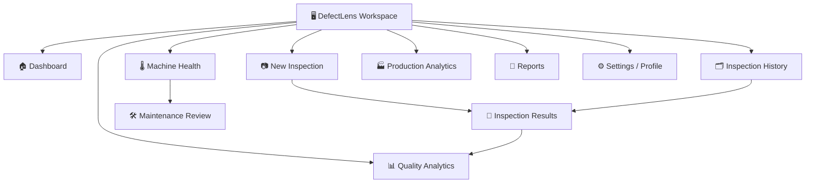

---

## 🗃️ 14 — Proposed Database Model

PostgreSQL is the relational database in the architecture slide. The diagram below is a **logical design proposal** to help the team plan data relationships; it is not proof that these exact tables exist in the current code.

### 🧬 Entity relationship diagram

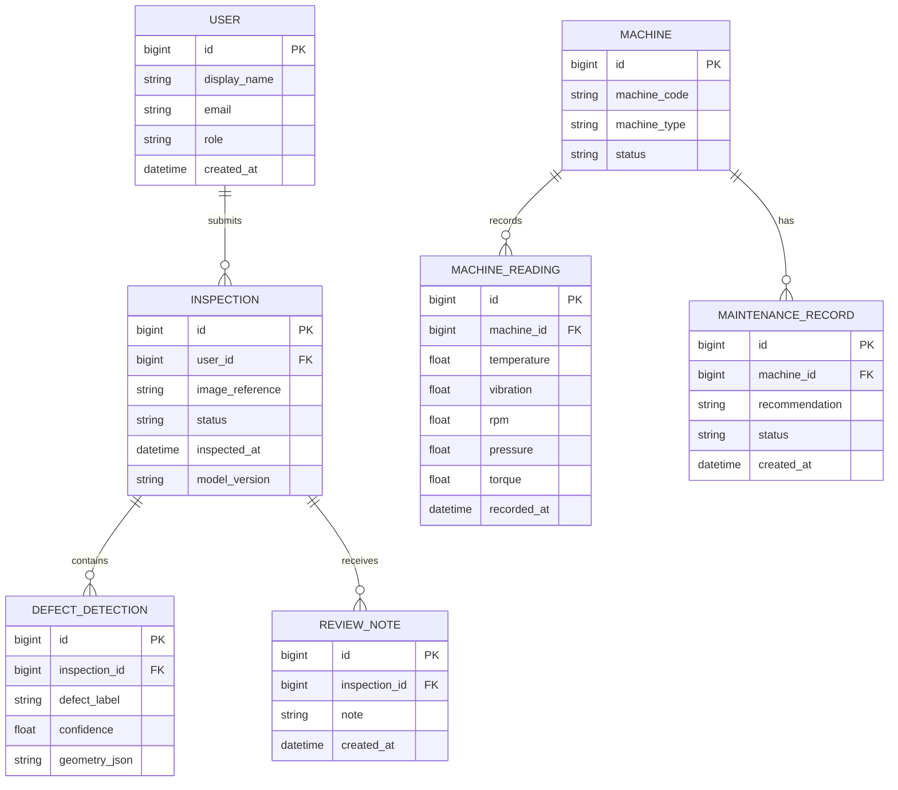

### 🧾 Table concepts

| Entity | What it represents | Design considerations |
|---|---|---|
| `USER` | A person using the application, if accounts exist | Unique email and appropriate access rules |
| `INSPECTION` | A submitted inspection and its status | Timestamp, image reference, model metadata |
| `DEFECT_DETECTION` | One detection returned for an inspection | Label, score, and geometry from the model |
| `MACHINE` | A machine or equipment asset | Stable identifier and type |
| `MACHINE_READING` | A time-stamped operational measurement | Units, machine ID, and time ordering |
| `MAINTENANCE_RECORD` | A recommendation or maintenance record | Evidence, status, and review history |
| `REVIEW_NOTE` | Human feedback or inspection note | Author and timestamp if accounts are implemented |

### 🛡️ Database design principles

- Use stable primary keys and valid foreign keys.
- Add indexes for frequently filtered timestamps and relationship fields.
- Keep database migrations under version control.
- Validate values before inserting them.
- Store time information consistently and document the time zone.
- Use transactions for multi-record operations that must succeed together.
- Do not store private credentials in table rows unless the design explicitly requires secure credential handling.
- Keep image storage strategy explicit: database metadata and image bytes are different concerns.
- Establish retention and deletion rules for images and inspection records.
- Ensure charts and reports query the same definitions of metrics.

### 🧭 Persistence lifecycle

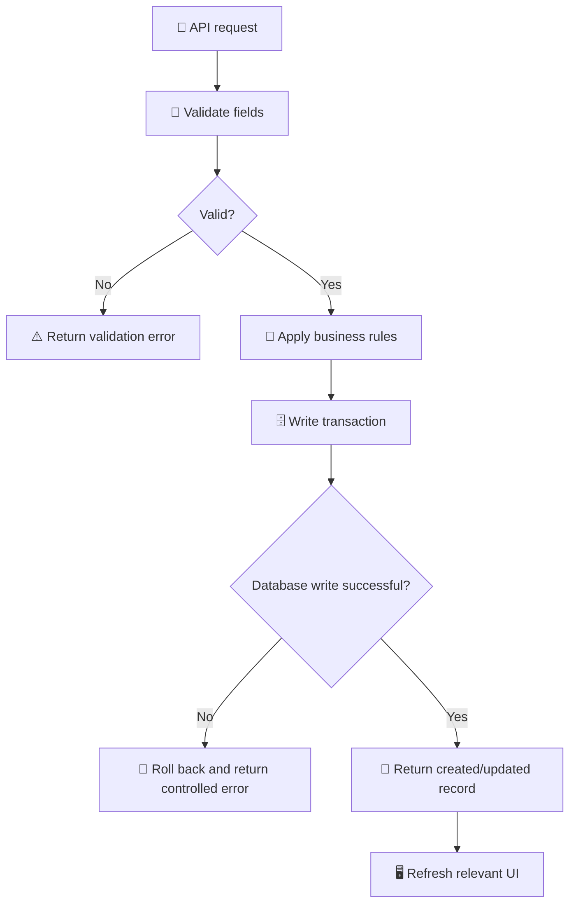

---

## 🔌 15 — Backend and API Contract

Spring Boot is the backend framework named in the current technology-stack slide. It can provide the API boundary for the React interface and coordinate access to PostgreSQL and the Python inference service.

> ⚠️ Routes in this section are examples for planning. Confirm exact endpoint names, HTTP methods, payloads, and authentication requirements in the backend source before using them.

### 🧭 Suggested API groups

| Group | Example route | Intent |
|---|---|---|
| Inspections | `POST /api/inspections` | Submit an inspection request |
| Inspections | `GET /api/inspections` | List inspection records |
| Inspections | `GET /api/inspections/{id}` | Fetch one inspection |
| Detections | `GET /api/inspections/{id}/detections` | Fetch detections for an inspection |
| Quality analytics | `GET /api/analytics/quality` | Retrieve quality summaries |
| Machines | `GET /api/machines` | List configured machines |
| Readings | `GET /api/machines/{id}/readings` | Retrieve machine readings |
| Production analytics | `GET /api/analytics/production` | Retrieve available production metrics |
| Maintenance | `GET /api/maintenance/recommendations` | List recommendations if implemented |

### 📦 Typical request lifecycle

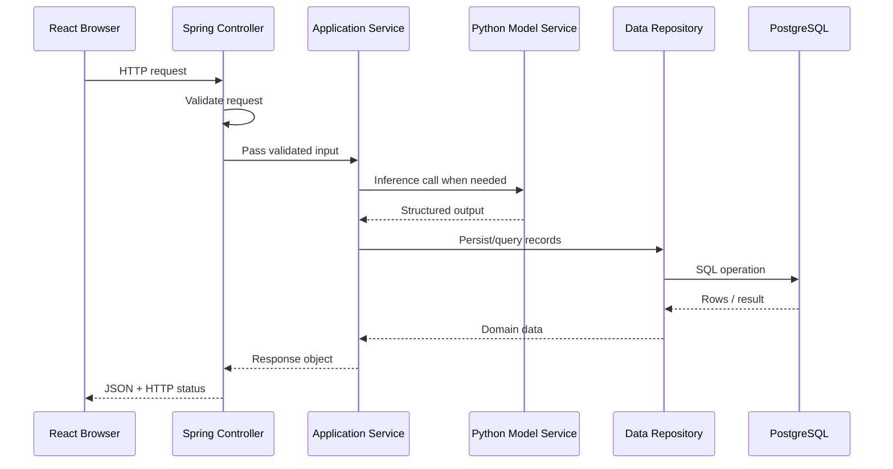

### 🧾 Response design principles

- Use a consistent success/error response format.
- Return meaningful HTTP status codes.
- Validate user-controlled inputs.
- Add pagination for long history lists.
- Avoid returning internal stack traces to clients.
- Use request timeouts for downstream calls.
- Handle duplicate submissions according to documented behaviour.
- Version the API if future changes may break clients.
- Keep API types and frontend TypeScript types aligned.

### 🚦 Example status-code intent

| Status | Typical meaning |
|---|---|
| `200 OK` | Request succeeded |
| `201 Created` | A record was created |
| `400 Bad Request` | Input is invalid |
| `401 Unauthorized` | Authentication is required or invalid |
| `403 Forbidden` | User lacks permission |
| `404 Not Found` | Resource does not exist |
| `413 Payload Too Large` | Upload exceeds configured limits |
| `422 Unprocessable Entity` | Input is syntactically valid but not acceptable for processing |
| `500 Internal Server Error` | Unexpected server failure |
| `503 Service Unavailable` | Required service is temporarily unavailable |

Choose status codes according to the actual API contract rather than copying this table blindly.

---

## 🎨 16 — Frontend Experience

The frontend should make a technically complex workflow feel approachable. React.js provides the component model, Tailwind CSS supports consistent styling, and Recharts provides visual analytics.

### 🧱 UI architecture concept

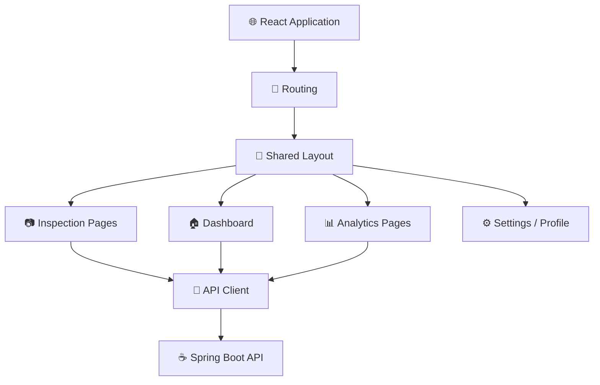

### ✨ UI quality principles

- **Clear hierarchy:** Make the primary action easy to locate.
- **Consistent spacing:** Use repeatable spacing and typography rules.
- **Readable charts:** Include axis labels, units, legends, and useful empty states.
- **Accessible controls:** Provide labels, keyboard support, and visible focus states.
- **Responsive layouts:** Ensure inspection workflows remain usable on smaller screens.
- **Honest status:** Do not display a successful result until the server returns one.
- **Useful errors:** Explain what happened and whether retrying is safe.
- **Evidence first:** Show the image and actual returned detections alongside model metadata.

### 📊 Chart selection guide

| Question | Suitable visual |
|---|---|
| Which defect class has the most detections? | Bar chart |
| How have inspection counts changed over time? | Line chart |
| How are categories distributed in one selected period? | Bar chart or a small pie chart, where appropriate |
| How does a machine reading change over time? | Line chart |
| Which records need review? | Table or status list |

Charts should reflect real API data. For academic demos, sample data must be labelled as sample data.

---

## 🔄 17 — Data Lifecycle

A robust data lifecycle explains where information comes from, how it is validated, how it is transformed, and how the result is retained.

### 📦 Lifecycle diagram

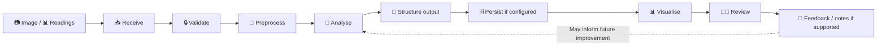

### 🧼 Data-quality checks

- Confirm that the input belongs to the intended workflow.
- Check required values and supported formats.
- Identify missing timestamps and unknown measurement units.
- Detect malformed or out-of-range numeric values.
- Preserve the link between a result and its source record.
- Record processing failures without exposing sensitive information.
- Do not silently turn missing data into zero.
- Document whether data is real, synthetic, manually entered, or imported.

### 🗂️ Data provenance

Where possible, the system should be able to answer:
- Which input generated this result?
- Which model or rule produced it?
- When was it processed?
- Which version of preprocessing was used?
- Was the result reviewed by a person?
- Was the output changed after review?

---

## 🔐 18 — Security and Responsible AI

Security and responsible use are part of the design, not just deployment tasks.

### 🔒 Application security

- Keep database credentials and Gemini API keys in server-side secrets.
- Never commit real `.env` files or secrets.
- Validate image content and enforce upload limits.
- Restrict database permissions to what the service needs.
- Configure production CORS for intended origins.
- Use HTTPS for deployed application traffic.
- Avoid logging credentials, tokens, or unnecessary sensitive payloads.
- Apply authentication and authorisation if protected user data is supported.
- Keep dependencies updated and review security advisories.
- Protect private industrial information and datasets.
- Apply appropriate rate limits and request timeouts.

### 🤖 AI safety principles

- Treat a model output as a prediction, not a confirmed engineering fact.
- Do not call a confidence score a guarantee.
- Explain when data is missing or model inference is unavailable.
- Keep generated text separate from verified evidence.
- Do not execute instructions or code produced by a language model.
- Ground generative-AI summaries in actual application records.
- Make limitations visible to users.
- Require qualified human review for safety-critical decisions.

### 🧭 Trust boundary

```mermaid
flowchart TD
    A["👤 User input"] --> B["🔒 Validate and constrain"]
    B --> C["☕ Backend policy checks"]
    C --> D["🧠 Model or AI service"]
    D --> E["🧪 Validate output schema"]
    E --> F["📎 Attach context and provenance"]
    F --> G["🖥️ Present as model-assisted result"]
    G --> H["👩‍🔧 Human decision"]
```

---

## 📁 19 — Repository Structure

The exact folders may differ while the team combines its frontend, backend, and Python service. Use this as a **suggested logical structure**, not a claim that every folder already exists.

```text
defect-lens/
├── frontend/                    # React.js + Tailwind CSS + Recharts
│   ├── public/
│   ├── src/
│   │   ├── components/          # Reusable UI components
│   │   ├── layouts/             # Shared page layouts
│   │   ├── pages/               # Route-level screens
│   │   ├── services/             # API client and request helpers
│   │   ├── hooks/                # Reusable React hooks
│   │   ├── types/                # Shared TypeScript types
│   │   └── utils/                # Formatting and helper functions
│   ├── package.json
│   └── vite.config.ts
├── backend/                     # Java / Spring Boot
│   ├── src/
│   │   ├── main/
│   │   │   ├── java/             # Controllers, services, repositories
│   │   │   └── resources/        # Application configuration
│   │   └── test/                 # Backend tests
│   └── pom.xml                   # If Maven is used
├── ai-service/                  # Python model service, if separate
│   ├── app/                      # API and inference code
│   ├── models/                   # Model references or local artefacts
│   ├── tests/
│   └── requirements.txt
├── docs/                        # Diagrams and project documentation
├── .gitignore
└── README.md
```

### 🧩 Service ownership

| Area | Main responsibility |
|---|---|
| `frontend/` | UI, routes, upload experience, chart rendering |
| `backend/` | Business logic, API validation, persistence orchestration |
| `ai-service/` | Image inference and supported ML analysis |
| `docs/` | Architecture, API contract, evaluation notes |

Keep model files, datasets, secrets, and generated outputs out of Git unless the team has explicitly approved their size, licensing, and privacy implications.

---

## 💻 20 — Local Setup

### 🧰 Prerequisites

Install the tools required by the services you intend to run:

- Git
- Node.js and npm for the React/Vite frontend
- A compatible JDK for the Spring Boot project
- Maven or the build tool used by the backend
- Python compatible with the AI/ML dependencies
- PostgreSQL or access to the configured PostgreSQL service

Docker is listed in the architecture slide but should only be used if the team has chosen to containerise its services.

### 📥 Clone the repository

```bash
git clone https://github.com/defect-lens/defect-lens.git
cd defect-lens
```

### 🎨 Frontend

```bash
cd frontend
npm install
npm run dev
```

Use the local URL printed by Vite. Check `package.json` for the actual available scripts.

### ☕ Spring Boot backend

Open a second terminal and navigate to the directory containing the backend build file.

If the project uses Maven Wrapper:

**Windows Command Prompt**
```bat
mvnw.cmd spring-boot:run
```

**macOS/Linux**
```bash
./mvnw spring-boot:run
```

If the wrapper is absent, use the build process documented by the backend project. These commands only work after the Spring Boot service and its configuration exist.

### 🐍 Python AI/ML service

Navigate to the Python service folder:

```bash
python -m venv .venv
```

Activate the environment:

**Windows Command Prompt**
```bat
.venv\Scripts\activate
```

**macOS/Linux**
```bash
source .venv/bin/activate
```

Install the dependencies recorded by the project:

```bash
pip install -r requirements.txt
```

Do not assume a `requirements.txt` exists until the team has created it. The file should contain the packages and compatible versions actually required by the service.

### 🗄️ Database

- Create or select a PostgreSQL database.
- Configure the backend connection.
- Apply the project's database migrations, if available.
- Verify that the application can connect.
- Avoid putting real credentials into committed files.

### 🧪 Setup verification

```mermaid
flowchart TD
    A["📥 Clone repository"] --> B["🎨 Install frontend dependencies"]
    B --> C["☕ Configure backend"]
    C --> D["🗄️ Configure PostgreSQL"]
    D --> E["🐍 Configure AI/ML dependencies if needed"]
    E --> F["▶️ Start required services"]
    F --> G["🔎 Verify health and API connectivity"]
    G --> H["📷 Run a test inspection"]
```

---

## 🔧 21 — Environment Configuration

The examples below are planning examples. Use the exact variable names expected by the current source code.

### 🎨 Frontend `.env.local`

```env
VITE_API_BASE_URL=http://localhost:8080/api
```

Vite variables beginning with `VITE_` are exposed to browser-side code. **Never store database passwords or private Gemini API keys in frontend environment variables.**

### ☕ Spring Boot configuration

Environment-variable examples:

```env
SPRING_DATASOURCE_URL=jdbc:postgresql://localhost:5432/defectlens
SPRING_DATASOURCE_USERNAME=your_database_user
SPRING_DATASOURCE_PASSWORD=replace_with_a_local_secret
```

These names must match the configuration used by the Spring Boot project. The example password is a placeholder, not a real credential.

### 🐍 Python service configuration

```env
MODEL_PATH=path/to/configured/model
MODEL_CONFIDENCE_THRESHOLD=0.25
```

These variables only have an effect if the Python service explicitly reads and uses them.

### ✨ Gemini API

Store the Gemini API key in the backend's server-side environment or secret manager. The application should fail gracefully if the optional integration is not configured.

### 🛡️ Environment checklist

- [ ] `.env` and `.env.local` are ignored by Git where appropriate.
- [ ] `.env.example` contains placeholders only.
- [ ] Production secrets are configured in the hosting provider.
- [ ] Frontend points to the correct API URL.
- [ ] Database credentials are never sent to the browser.
- [ ] AI service URLs and model paths are configured per environment.

---

## ▶️ 22 — Running the Services

An integrated local setup may require several terminals.

| Terminal | Service | Responsibility |
|---|---|---|
| 1 | PostgreSQL | Structured data storage |
| 2 | Spring Boot | Application API |
| 3 | Python/FastAPI | Inference service, if separate |
| 4 | React/Vite | Frontend interface |

### 🧭 Startup and verification

1. Start PostgreSQL or verify access to the configured database.
2. Start Spring Boot with valid environment settings.
3. Start the Python service if the backend requires it.
4. Start the React development server.
5. Open the URL shown by Vite.
6. Submit a supported test input.
7. Inspect the browser network panel for request and response details.
8. Check service logs for safe diagnostic information.
9. Confirm that the UI displays the actual response.
10. Test invalid input and service failure cases.

### 🔌 Integration map

```mermaid
flowchart LR
    A["React/Vite"] -->|"HTTP request"| B["Spring Boot"]
    B -->|"SQL"| C[("PostgreSQL")]
    B -->|"Inference request, if configured"| D["Python/FastAPI"]
    D --> E["YOLO / PyTorch model"]
    E --> D
    D --> B
    B --> A
```

If the backend or model service has not been implemented, the related workflow is not yet end-to-end functional even if the frontend can be opened.

---

## 🧪 23 — Testing and Quality Gates

Testing should cover the UI, backend, database, AI/ML logic, and the boundaries between services.

### 🎨 Frontend test areas

- Page and route rendering.
- Responsive layouts.
- Upload validation.
- Loading and error states.
- Rendering of empty and populated results.
- Chart labels, units, and data correctness.
- Handling of missing or unexpected API fields.
- Keyboard navigation and visible focus.

### ☕ Backend test areas

- Input validation.
- HTTP status codes.
- Database create/read/update operations that exist.
- Missing and invalid record IDs.
- Transaction behaviour.
- Permission checks, if authentication is implemented.
- Downstream-service timeout and failure handling.
- Safe error responses.

### 🧠 AI/ML test areas

- Model loads with the expected configuration.
- Input preprocessing matches training.
- Returned labels match the configured class mapping.
- Geometry and confidence values are valid.
- Inference failures are controlled.
- Performance is evaluated on held-out data.
- Model version and relevant metadata are recorded.

### 🔗 Integration test areas

- React communicates with Spring Boot.
- Spring Boot communicates with PostgreSQL.
- Spring Boot communicates with the Python service, if separated.
- Stored records can be fetched and rendered.
- Analytics agree with the source records.
- Unavailable services do not produce false success states.

### 🧾 Example test matrix

| ID | Scenario | Expected result |
|---|---|---|
| T-01 | Supported image uploaded | Request proceeds to configured inference |
| T-02 | Unsupported file uploaded | Input is rejected with a clear message |
| T-03 | File exceeds configured size | Upload is rejected safely |
| T-04 | Model service unavailable | Controlled error; no fabricated detections |
| T-05 | Unknown inspection ID | Appropriate not-found response |
| T-06 | Database unavailable | Controlled service error |
| T-07 | Empty inspection history | Meaningful empty state |
| T-08 | No machine readings | Clear unavailable-data state |
| T-09 | Gemini key absent | Optional AI assistance reports unavailable |
| T-10 | Unexpected model output | Output validation prevents broken rendering |
| T-11 | API returns no detections | UI shows no detections, not an error unless specified |
| T-12 | Chart receives new data | Chart reflects the API response accurately |

### 🚦 Quality gate

```mermaid
flowchart TD
    A["🧑‍💻 Code change"] --> B["🔍 Review"]
    B --> C["🧪 Run relevant tests"]
    C --> D{"Tests pass?"}
    D -->|No| E["🛠️ Fix and retest"]
    E --> C
    D -->|Yes| F["🏗️ Build"]
    F --> G{"Build succeeds?"}
    G -->|No| E
    G -->|Yes| H["🔀 Pull request review"]
    H --> I["✅ Merge when approved"]
```

---

## 📏 24 — Model Evaluation

A visual AI project should report measured performance, not just show a model prediction in the interface.

### 📊 Useful detection metrics

| Metric | What it indicates |
|---|---|
| Precision | How many predicted detections are correct |
| Recall | How many relevant labelled defects are detected |
| F1 score | Harmonic balance between precision and recall |
| mAP | Detection performance aggregated across classes and thresholds according to the chosen evaluation protocol |
| Confusion matrix | Patterns of correct and incorrect class predictions |
| Inference latency | Time required to process an input under stated conditions |
| False-positive rate | Frequency of incorrect alerts under the defined evaluation method |
| False-negative rate | Frequency of missed defects under the defined evaluation method |

### 🧪 Evaluation workflow

```mermaid
flowchart TD
    A["📚 Labelled dataset"] --> B["🧹 Data quality review"]
    B --> C["✂️ Train / validation / test split"]
    C --> D["🤖 Train or configure model"]
    D --> E["🎛️ Select settings using validation data"]
    E --> F["🔒 Freeze final configuration"]
    F --> G["🧪 Evaluate on held-out test data"]
    G --> H["📏 Calculate metrics"]
    H --> I["🧾 Document errors and limitations"]
    I --> J["📦 Version model and report"]
```

### 🧠 Dataset considerations

- Ensure labels are consistent and documented.
- Avoid near-duplicate images leaking across train and test sets.
- Include relevant variation in lighting, camera angle, surfaces, and defect size.
- Inspect class imbalance.
- Record the source and permitted use of the dataset.
- Separate evaluation images from training-time tuning.
- Keep a record of the model version and inference configuration.

### 🧾 Report template

When results have actually been measured, document:

| Item | Value to fill in |
|---|---|
| Dataset source | `[dataset name/source]` |
| Number of images | `[measured count]` |
| Defect classes | `[actual model classes]` |
| Train/validation/test split | `[actual split]` |
| Model and version | `[actual configuration]` |
| Precision | `[measured result]` |
| Recall | `[measured result]` |
| mAP / F1 | `[measured result and definition]` |
| Inference environment | `[hardware/runtime]` |
| Average latency | `[measured duration]` |
| Known failure modes | `[observed limitations]` |

Never fill this table with invented metrics.

---

## 🚀 25 — Deployment Blueprint

The architecture slide lists Vercel and Render as deployment options. Final hosting should be chosen based on the requirements of the actual React, Java, Python, and database services.

### 🗺️ Deployment architecture

```mermaid
flowchart TD
    A["👩‍💻 Developer"] --> B["Git commit"]
    B --> C["GitHub repository"]
    C --> D["Build and test"]
    D --> E{"Build and checks pass?"}
    E -->|No| F["🧯 Fix before release"]
    F --> B
    E -->|Yes| G["🚀 Deploy frontend to Vercel"]
    E -->|Yes| H["☕ Deploy Spring Boot to compatible host"]
    E -->|Yes| I["🐍 Deploy Python service if separate"]
    H --> J[("PostgreSQL service")]
    H --> I
    G --> H
    G --> K["🔎 Smoke tests"]
    H --> K
    I --> K
    J --> K
    K --> L["✅ Release only after verification"]
```

### 🎨 Frontend deployment

Vercel is an option for the React/Vite frontend.

Typical Vite configuration:
- Build command: `npm run build`
- Output directory: `dist`

Confirm the correct root directory, build command, and output directory against the repository. Set the production API base URL to the deployed backend endpoint.

### ☕ Spring Boot deployment

Deploy the Java service to a host that supports the chosen Java version and startup model. Configure:
- Runtime version.
- Build and start commands.
- Database URL and credentials.
- CORS allowed origins.
- Health checks.
- Logs and request timeouts.

Render is listed in the slide as a deployment option, but confirm its current runtime requirements and your application's configuration before selecting it.

### 🐍 Python service deployment

If Python inference is deployed separately, verify:
- Python runtime and compatible package versions.
- Model artefact availability.
- Startup command and health check.
- CPU/GPU requirements.
- Request limits and timeouts.
- Access control between the backend and model service.
- Inference performance in the deployed environment.

### 🗄️ PostgreSQL deployment

Use a PostgreSQL service configured for the chosen deployment. If Supabase is selected, configure its database connection according to its supported connection options and the host's network constraints.

### 🚦 Release checklist

- [ ] Frontend production build succeeds.
- [ ] Backend build succeeds.
- [ ] Python service starts, if used.
- [ ] Database migrations are applied.
- [ ] Secrets are configured in hosting settings.
- [ ] No secrets are committed.
- [ ] Frontend calls the intended API URL.
- [ ] Backend can reach PostgreSQL.
- [ ] Backend can reach the AI/ML service.
- [ ] Upload limits and timeouts are set.
- [ ] CORS is restricted appropriately.
- [ ] Health checks pass.
- [ ] A real end-to-end test is completed.
- [ ] Public URLs are documented only after verification.

---

## 🩺 26 — Error Handling and Observability

A dependable system makes failures understandable without exposing internal details.

### 🧯 Error-handling map

```mermaid
flowchart TD
    A["📨 Incoming request"] --> B["🔍 Validate input"]
    B --> C{"Valid?"}
    C -->|No| D["⚠️ Return client-safe validation error"]
    C -->|Yes| E["⚙️ Execute workflow"]
    E --> F{"Dependency succeeded?"}
    F -->|No| G["🧾 Record safe diagnostic context"]
    G --> H["🛑 Return controlled error"]
    F -->|Yes| I["🧪 Validate output"]
    I --> J["📨 Return success response"]
```

### 📋 Useful operational signals

| Signal | Why it matters |
|---|---|
| Request count | Shows how often endpoints are used |
| Error rate | Highlights failing workflows |
| Response latency | Helps identify slow requests |
| Inference duration | Measures model processing time |
| Model/service availability | Helps distinguish model failures from input errors |
| Database errors | Highlights persistence issues |
| Upload rejection count | Helps monitor validation outcomes |
| Model version | Makes results easier to trace |

Only add monitoring systems if they are part of the implementation. Logs should not contain private keys, passwords, or unnecessary sensitive data.

---

## ⚠️ 27 — Known Constraints

DefectLens is an AI-assisted academic project concept. It should be evaluated honestly against its current implementation.

### 🧱 Technical constraints

- Detection quality depends on the dataset, labels, and model configuration.
- Lighting, reflections, camera angles, and image resolution may affect results.
- Unseen defect types may not be recognised.
- A visual detector does not automatically estimate defect severity or repair cost.
- Predictive maintenance requires suitable operational data and, for supervised learning, meaningful labels.
- Root-cause analysis depends on relevant records and cannot infer missing evidence.
- Generative-AI summaries may be incorrect or incomplete.
- Deployment compatibility depends on runtime, model size, memory, and dependency configuration.
- Real manufacturing use requires validation, monitoring, and operational safeguards.

### 🚧 Scope boundary

| Area | Safe description until verified |
|---|---|
| Live sensors | Use “available readings” or “sample readings” unless real ingestion is implemented |
| Predictive maintenance | Say “analysis workflow” unless a validated predictive model exists |
| Real-time inference | Claim only after measuring actual end-to-end latency |
| AI-generated explanation | Describe as optional assistance if Gemini is configured |
| Deployment | List platforms as options until a deployment is tested |
| Authentication | Describe only the mechanisms implemented in the code |
| Analytics | Use actual database values or label demo data clearly |

---

## 🔮 28 — Future Roadmap

A practical roadmap can improve the project incrementally without claiming that future features already exist.

```mermaid
flowchart LR
    A["🧱 Phase 1<br/>Core UI and API"] --> B["📷 Phase 2<br/>Image inference"]
    B --> C["🗄️ Phase 3<br/>Persistence and history"]
    C --> D["📊 Phase 4<br/>Quality analytics"]
    D --> E["🌡️ Phase 5<br/>Machine-health data"]
    E --> F["🧠 Phase 6<br/>Validated prediction"]
    F --> G["🔍 Phase 7<br/>Evidence-linked investigation"]
    G --> H["🚀 Phase 8<br/>Deployment and monitoring"]
```

### 🌱 Possible enhancements

1. Expand the labelled dataset with representative defect examples.
2. Compare detection models against a documented baseline.
3. Add reviewer feedback and correction workflows.
4. Track model versions and inference settings.
5. Improve image overlays and evidence presentation.
6. Add machine-health trend views for valid time-series data.
7. Evaluate predictive-maintenance models with labelled historical data.
8. Add evidence-linked explanations and uncertainty indicators.
9. Add report export if users need it.
10. Improve authentication and audit trails where required.
11. Add robust health checks and deployment automation.
12. Validate on hardware and images representative of the intended environment.

### 🧭 Prioritisation framework

| Priority | Focus | Why |
|---|---|---|
| P0 | Reliable end-to-end inspection | Establishes the core product workflow |
| P1 | Data persistence and history | Makes results traceable |
| P1 | Clear error and empty states | Improves reliability and usability |
| P2 | Quality analytics | Adds value from stored records |
| P2 | Model evaluation | Establishes evidence for model quality |
| P3 | Machine-health prediction | Requires suitable data and validation |
| P3 | Advanced AI explanations | Should follow evidence and security controls |

---

## 👥 29 — Team and Acknowledgement

<div align="center">

### 🎓 RMD SINHGAD TECHNICAL INSTITUTE

**Project:** DefectLens — AI-Powered Visual Quality Inspection & Predictive Maintenance Platform for Automotive Manufacturing

</div>

| 👩‍💻 Team member |
|---|
| Rutvi Landge |
| Sakshi Barhate |
| Rutuja Kashid |
| Ritesh Kadam |

This project brings together web development, computer vision, machine learning, data management, and manufacturing-quality concepts. The team should document individual contributions according to the work each member actually completes.

---

## 🤝 30 — Contribution Workflow

Contributions should keep the project maintainable and easy to review.

### 🔀 Suggested Git workflow

```mermaid
flowchart TD
    A["🍴 Fork or create approved branch"] --> B["🌿 Create feature branch"]
    B --> C["💻 Implement scoped change"]
    C --> D["🧪 Run relevant checks"]
    D --> E{"Checks pass?"}
    E -->|No| F["🛠️ Fix and rerun"]
    F --> D
    E -->|Yes| G["📤 Push branch"]
    G --> H["🔍 Open pull request"]
    H --> I["👀 Review and discuss"]
    I --> J{"Approved?"}
    J -->|No| C
    J -->|Yes| K["✅ Merge"]
```

### 🧾 Contribution guidelines

1. Keep changes focused and small where practical.
2. Coordinate API changes with the owners of connected services.
3. Avoid committing secrets, private datasets, or unapproved industrial data.
4. Run the relevant tests before opening a pull request.
5. Explain what changed and how it was tested.
6. Include screenshots when visual changes are important to review.
7. Document new environment variables with safe placeholder values.
8. Update diagrams and API documentation when the architecture changes.

### 📜 License

Add a license only after the project team has agreed on the terms. Until then, this README intentionally does not claim that the repository is distributed under a particular open-source license.

---

## 🏁 31 — Final Word

<div align="center">

### 🏭✨ DEFECTLENS

**See the defect. Trace the evidence. Protect production.**

A thoughtful blend of web engineering, computer vision, data analysis, and maintenance intelligence—built with an emphasis on evidence, transparency, and human judgement.

</div>

---

### 📌 Documentation maintenance checklist

- [ ] Technology stack matches the current project slide.
- [ ] Architecture diagrams match the implemented services.
- [ ] API routes match the backend source code.
- [ ] Database diagram matches actual entities/migrations or is labelled proposed.
- [ ] Setup instructions have been tested by a team member.
- [ ] Example environment variables match the application.
- [ ] Screenshots and demo data are not represented as production results.
- [ ] Model metrics are measured, not invented.
- [ ] Deployment claims are verified.
- [ ] Team names and institution wording are correct.

# 📚 Appendix A — Implementation Playbooks

This appendix gives the team concrete checklists for implementation and review. These are planning guides, not claims that the described features are already present.

## A.1 📷 Image upload checklist

- [ ] File selection works using the intended browser input.
- [ ] The UI shows the selected filename and preview only after validation.
- [ ] Accepted formats are documented.
- [ ] The maximum file size is configured on both client and server.
- [ ] The server validates the actual file content.
- [ ] The UI prevents accidental repeated submission when appropriate.
- [ ] Upload progress is shown only when measurable.
- [ ] The request uses the agreed backend endpoint and payload format.
- [ ] The user can recover from a validation error.
- [ ] A failed request never renders a fake detection result.
- [ ] The image is linked to its inspection record if persistence is enabled.
- [ ] Sensitive image data is not written to unnecessary logs.

## A.2 🎯 Detection overlay checklist

- [ ] Model coordinates are mapped to the displayed image dimensions.
- [ ] Bounding boxes stay within the image boundaries.
- [ ] Class identifiers map to the configured labels.
- [ ] Confidence values are formatted consistently.
- [ ] The confidence threshold is documented.
- [ ] No overlay is drawn when coordinates are invalid.
- [ ] The original image remains available for comparison.
- [ ] The overlay is accessible to users who cannot distinguish colours alone.
- [ ] The interface explains that a detection is a model prediction.
- [ ] Any segmentation overlay is only displayed if the model returns masks.

## A.3 🗃️ Database checklist

- [ ] Entity names and relationships are documented.
- [ ] Primary keys are stable and unique.
- [ ] Foreign-key relationships are enforced where appropriate.
- [ ] Timestamps have a consistent interpretation.
- [ ] Units are documented for machine readings.
- [ ] Indexes are selected based on query patterns.
- [ ] Schema changes use migrations.
- [ ] Test data is separated from production data.
- [ ] Retention and deletion rules are documented.
- [ ] Database errors are handled without exposing credentials.
- [ ] Connection settings are configured outside committed source files.

## A.4 📊 Analytics checklist

- [ ] Each metric has a precise definition.
- [ ] Filters and date ranges are visible.
- [ ] The chart uses API data rather than accidental hard-coded values.
- [ ] Empty data produces an explanatory state.
- [ ] Missing values are not treated as zero without an explicit rule.
- [ ] Counts are consistent with the underlying records.
- [ ] Time-zone behaviour is documented.
- [ ] Chart axes and units are labelled.
- [ ] The chart remains usable on small screens.
- [ ] Any sample/demo data is labelled as such.

## A.5 🌡️ Machine-health checklist

- [ ] Every reading has a machine identifier.
- [ ] Timestamps are available and valid.
- [ ] Units are known.
- [ ] Sampling intervals are documented.
- [ ] Missing readings are handled explicitly.
- [ ] Machine operating state is considered where available.
- [ ] Thresholds have a documented source.
- [ ] Rule-based alerts are not called trained predictions.
- [ ] Model outputs are evaluated on appropriate data.
- [ ] A qualified person reviews important maintenance decisions.

## A.6 ✨ Generative-AI checklist

- [ ] Gemini integration is optional and configured server-side.
- [ ] API keys are not included in frontend bundles.
- [ ] Only necessary context is sent to the service.
- [ ] Model-generated text is clearly labelled.
- [ ] The system does not treat generated content as verified sensor data.
- [ ] The output is checked for the expected structure where structured output is used.
- [ ] Failures and rate limits are handled.
- [ ] The UI remains usable when the AI service is unavailable.
- [ ] Generated recommendations do not bypass human review.
- [ ] The documentation states the limitations of generated explanations.

## A.7 🚀 Release readiness checklist

- [ ] Frontend build succeeds.
- [ ] Backend build succeeds.
- [ ] AI/ML service starts if required.
- [ ] Database migrations are applied.
- [ ] Secrets are configured on the host.
- [ ] Service-to-service URLs are correct.
- [ ] CORS is restricted to intended origins.
- [ ] Health checks pass.
- [ ] Logs do not reveal secrets.
- [ ] A supported test input completes end to end.
- [ ] Error paths have been tested.
- [ ] README instructions reflect the actual deployment.

---

# 📘 Appendix B — Glossary

| Term | Plain-language meaning |
|---|---|
| AI | Artificial intelligence; techniques that allow software to perform tasks associated with intelligent behaviour |
| API | A defined interface through which software components communicate |
| Backend | Server-side application code |
| Bounding box | A rectangle marking a detected object's location in an image |
| Computer vision | Methods for analysing images or video |
| Confidence score | A model-generated score associated with a prediction; not a guarantee |
| Dataset | A collection of examples used for development or evaluation |
| Defect class | A label representing a type of defect |
| Detection | A model output indicating a possible object or defect and its location |
| FastAPI | A Python framework for building APIs |
| False negative | A relevant defect that the system fails to detect |
| False positive | A prediction that incorrectly identifies a defect |
| Feature engineering | Preparing input variables for a machine-learning model |
| F1 score | A metric combining precision and recall |
| Inference | Running a trained/configured model on new input |
| mAP | Mean average precision, a common object-detection evaluation metric |
| Model drift | A change in input or performance characteristics over time |
| OpenCV | A computer-vision library |
| PostgreSQL | A relational database management system |
| Predictive maintenance | Using data to help anticipate maintenance needs |
| Precision | The proportion of predicted positives that are correct under a defined evaluation |
| Recall | The proportion of relevant positives found by the model |
| Recharts | A charting library for React |
| REST API | A web API style commonly using HTTP methods and resources |
| Root-cause analysis | Investigation into factors that may explain an event |
| scikit-learn | A Python library for traditional machine learning |
| Spring Boot | A Java framework for building applications and services |
| Tailwind CSS | A utility-first CSS framework |
| Time series | Measurements recorded in time order |
| Training | The process of fitting a model using data |
| Validation set | Data used to select settings during model development |
| YOLO | A family of object-detection models |
| Vercel | A web deployment platform |
| Render | A cloud platform used to deploy applications and services |
| Git | A distributed version-control system |
| GitHub | A platform for hosting Git repositories and collaboration |

---

# 🧭 Appendix C — Suggested Academic Demonstration Plan

A concise demonstration can show the implemented parts of the project without overstating the maturity of unfinished modules.

## C.1 Demo sequence

```mermaid
flowchart LR
    A["👋 Introduce the problem"] --> B["🧰 Explain the technology stack"]
    B --> C["🖥️ Open the application"]
    C --> D["📷 Demonstrate supported inspection input"]
    D --> E["🎯 Show actual model response"]
    E --> F["🗂️ Open stored history if implemented"]
    F --> G["📊 Show analytics from actual data"]
    G --> H["🌡️ Explain machine-health workflow"]
    H --> I["🧪 Discuss evaluation and limitations"]
    I --> J["🚀 Summarise future scope"]
```

## C.2 What to prepare

- A small set of images that the team is allowed to use.
- The actual model's supported class labels.
- A clearly labelled sample dataset if live data is unavailable.
- A verified end-to-end workflow.
- Screenshots of implemented pages.
- Measured evaluation results, if available.
- A short explanation of the backend and AI/ML service boundary.
- A list of limitations and planned improvements.

## C.3 Questions the team should be ready to answer

1. Why was YOLO selected for the proposed detection task?
2. Which defect labels does the configured model actually support?
3. How was the dataset labelled and split?
4. Which metrics were measured, and on what test data?
5. What happens if the model service is unavailable?
6. How does the frontend communicate with Spring Boot?
7. Where are inspection records stored?
8. What is the difference between PostgreSQL and Supabase?
9. Which machine-health parameters are available in the current prototype?
10. What evidence supports a maintenance recommendation?
11. Which features are implemented and which are planned?
12. How are secrets and uploaded images protected?

---

# 🧱 Appendix D — Architecture Decision Record Template

Use this template whenever the team makes a meaningful technology or architecture decision.

## Decision: `[Short title]`

- **Status:** Proposed / Accepted / Superseded
- **Date:** `[YYYY-MM-DD]`
- **Context:** What problem or constraint requires a decision?
- **Options considered:** Which reasonable alternatives were evaluated?
- **Decision:** What did the team choose?
- **Rationale:** Why was this option selected?
- **Trade-offs:** What disadvantages or limitations remain?
- **Implementation impact:** Which services, files, or APIs change?
- **Validation:** How will the team verify that the decision works?
- **Review trigger:** What future event could cause the decision to be revisited?

### Example decision topics

- PostgreSQL connection strategy.
- Whether Supabase is used as a managed database platform.
- Whether Python inference is a separate FastAPI service.
- Model file storage and versioning.
- Upload-size limits.
- Confidence threshold selection.
- Frontend/backend API contract.
- Hosting choice for the Java service.
- Hosting choice for the Python service.
- Whether Docker is needed for local development or deployment.

---

# 🧪 Appendix E — Test Evidence Record Template

For academic reporting, record test evidence in a consistent format.

| Field | Value |
|---|---|
| Test ID | `[unique identifier]` |
| Date | `[date tested]` |
| Build/commit | `[commit hash or build version]` |
| Test environment | `[OS, runtime, browser, hardware]` |
| Input | `[test image or sample data identifier]` |
| Expected behaviour | `[expected result]` |
| Actual behaviour | `[observed result]` |
| Pass/fail | `[result]` |
| Evidence | `[screenshot, log reference, or test report]` |
| Notes | `[limitations or follow-up]` |

Do not include private production data, credentials, or sensitive manufacturing details in public test evidence.

---

# 🎨 Appendix F — README Maintenance Guide

This README is designed to be detailed, but documentation should remain aligned with the code.

Update the README whenever the team changes:
- The selected technology stack.
- The actual folder structure.
- API routes or request/response formats.
- Database entities or migrations.
- Model classes or inference outputs.
- Environment variable names.
- Local startup instructions.
- Deployment targets or public service URLs.
- Measured model performance.
- Team membership or institutional wording.

Before submitting the project, review the diagrams in GitHub's Markdown renderer. Mermaid support can vary across renderers. If a diagram fails to render, check Mermaid syntax and the host's supported diagram version.

**Documentation rule:** describe the implemented system accurately, label proposed features clearly, and never replace missing evidence with invented metrics.


## 🧭 Implementation Review 01 — Service Readiness

Use this review checkpoint when integrating the frontend, Spring Boot backend, PostgreSQL database, and Python AI/ML components.

### 🔎 Review questions
- [ ] Is the component's responsibility documented?
- [ ] Are input and output contracts agreed upon with connected services?
- [ ] Are required environment variables documented with placeholders?
- [ ] Are invalid inputs rejected safely?
- [ ] Are loading, empty, success, and error states handled?
- [ ] Are credentials kept out of source control and browser bundles?
- [ ] Is the component's behaviour covered by a test or a recorded manual check?
- [ ] Are limitations documented for the academic demonstration?
- [ ] Does the README distinguish implemented functionality from planned functionality?
- [ ] Has a team member reviewed the change?

### 🧩 Service-specific reminder
Frontend: verify routes, upload behaviour, API base URL, responsive layout, and chart data.

### 🏁 Review outcome
- **Status:** Not started / In progress / Verified
- **Evidence:** Add a test reference, screenshot, or commit link after completing the check.
- **Follow-up:** Record unresolved issues rather than marking incomplete work as done.


## 🧭 Implementation Review 02 — Service Readiness

Use this review checkpoint when integrating the frontend, Spring Boot backend, PostgreSQL database, and Python AI/ML components.

### 🔎 Review questions
- [ ] Is the component's responsibility documented?
- [ ] Are input and output contracts agreed upon with connected services?
- [ ] Are required environment variables documented with placeholders?
- [ ] Are invalid inputs rejected safely?
- [ ] Are loading, empty, success, and error states handled?
- [ ] Are credentials kept out of source control and browser bundles?
- [ ] Is the component's behaviour covered by a test or a recorded manual check?
- [ ] Are limitations documented for the academic demonstration?
- [ ] Does the README distinguish implemented functionality from planned functionality?
- [ ] Has a team member reviewed the change?

### 🧩 Service-specific reminder
Spring Boot: verify validation, status codes, persistence, downstream timeouts, and safe errors.

### 🏁 Review outcome
- **Status:** Not started / In progress / Verified
- **Evidence:** Add a test reference, screenshot, or commit link after completing the check.
- **Follow-up:** Record unresolved issues rather than marking incomplete work as done.


## 🧭 Implementation Review 03 — Service Readiness

Use this review checkpoint when integrating the frontend, Spring Boot backend, PostgreSQL database, and Python AI/ML components.

### 🔎 Review questions
- [ ] Is the component's responsibility documented?
- [ ] Are input and output contracts agreed upon with connected services?
- [ ] Are required environment variables documented with placeholders?
- [ ] Are invalid inputs rejected safely?
- [ ] Are loading, empty, success, and error states handled?
- [ ] Are credentials kept out of source control and browser bundles?
- [ ] Is the component's behaviour covered by a test or a recorded manual check?
- [ ] Are limitations documented for the academic demonstration?
- [ ] Does the README distinguish implemented functionality from planned functionality?
- [ ] Has a team member reviewed the change?

### 🧩 Service-specific reminder
Python/YOLO: verify preprocessing, model path, class mapping, confidence threshold, and output schema.

### 🏁 Review outcome
- **Status:** Not started / In progress / Verified
- **Evidence:** Add a test reference, screenshot, or commit link after completing the check.
- **Follow-up:** Record unresolved issues rather than marking incomplete work as done.


## 🧭 Implementation Review 04 — Service Readiness

Use this review checkpoint when integrating the frontend, Spring Boot backend, PostgreSQL database, and Python AI/ML components.

### 🔎 Review questions
- [ ] Is the component's responsibility documented?
- [ ] Are input and output contracts agreed upon with connected services?
- [ ] Are required environment variables documented with placeholders?
- [ ] Are invalid inputs rejected safely?
- [ ] Are loading, empty, success, and error states handled?
- [ ] Are credentials kept out of source control and browser bundles?
- [ ] Is the component's behaviour covered by a test or a recorded manual check?
- [ ] Are limitations documented for the academic demonstration?
- [ ] Does the README distinguish implemented functionality from planned functionality?
- [ ] Has a team member reviewed the change?

### 🧩 Service-specific reminder
PostgreSQL: verify migrations, relationships, timestamps, constraints, and query behaviour.

### 🏁 Review outcome
- **Status:** Not started / In progress / Verified
- **Evidence:** Add a test reference, screenshot, or commit link after completing the check.
- **Follow-up:** Record unresolved issues rather than marking incomplete work as done.


## 🧭 Implementation Review 05 — Service Readiness

Use this review checkpoint when integrating the frontend, Spring Boot backend, PostgreSQL database, and Python AI/ML components.

### 🔎 Review questions
- [ ] Is the component's responsibility documented?
- [ ] Are input and output contracts agreed upon with connected services?
- [ ] Are required environment variables documented with placeholders?
- [ ] Are invalid inputs rejected safely?
- [ ] Are loading, empty, success, and error states handled?
- [ ] Are credentials kept out of source control and browser bundles?
- [ ] Is the component's behaviour covered by a test or a recorded manual check?
- [ ] Are limitations documented for the academic demonstration?
- [ ] Does the README distinguish implemented functionality from planned functionality?
- [ ] Has a team member reviewed the change?

### 🧩 Service-specific reminder
Gemini integration: verify server-side key handling, grounded context, output validation, and fallback behaviour.

### 🏁 Review outcome
- **Status:** Not started / In progress / Verified
- **Evidence:** Add a test reference, screenshot, or commit link after completing the check.
- **Follow-up:** Record unresolved issues rather than marking incomplete work as done.


## 🧭 Implementation Review 06 — Service Readiness

Use this review checkpoint when integrating the frontend, Spring Boot backend, PostgreSQL database, and Python AI/ML components.

### 🔎 Review questions
- [ ] Is the component's responsibility documented?
- [ ] Are input and output contracts agreed upon with connected services?
- [ ] Are required environment variables documented with placeholders?
- [ ] Are invalid inputs rejected safely?
- [ ] Are loading, empty, success, and error states handled?
- [ ] Are credentials kept out of source control and browser bundles?
- [ ] Is the component's behaviour covered by a test or a recorded manual check?
- [ ] Are limitations documented for the academic demonstration?
- [ ] Does the README distinguish implemented functionality from planned functionality?
- [ ] Has a team member reviewed the change?

### 🧩 Service-specific reminder
Machine health: verify units, timestamps, machine identity, missing data, and evidence behind alerts.

### 🏁 Review outcome
- **Status:** Not started / In progress / Verified
- **Evidence:** Add a test reference, screenshot, or commit link after completing the check.
- **Follow-up:** Record unresolved issues rather than marking incomplete work as done.


## 🧭 Implementation Review 07 — Service Readiness

Use this review checkpoint when integrating the frontend, Spring Boot backend, PostgreSQL database, and Python AI/ML components.

### 🔎 Review questions
- [ ] Is the component's responsibility documented?
- [ ] Are input and output contracts agreed upon with connected services?
- [ ] Are required environment variables documented with placeholders?
- [ ] Are invalid inputs rejected safely?
- [ ] Are loading, empty, success, and error states handled?
- [ ] Are credentials kept out of source control and browser bundles?
- [ ] Is the component's behaviour covered by a test or a recorded manual check?
- [ ] Are limitations documented for the academic demonstration?
- [ ] Does the README distinguish implemented functionality from planned functionality?
- [ ] Has a team member reviewed the change?

### 🧩 Service-specific reminder
Quality analytics: verify metric definitions, filters, empty states, and agreement with source records.

### 🏁 Review outcome
- **Status:** Not started / In progress / Verified
- **Evidence:** Add a test reference, screenshot, or commit link after completing the check.
- **Follow-up:** Record unresolved issues rather than marking incomplete work as done.


## 🧭 Implementation Review 08 — Service Readiness

Use this review checkpoint when integrating the frontend, Spring Boot backend, PostgreSQL database, and Python AI/ML components.

### 🔎 Review questions
- [ ] Is the component's responsibility documented?
- [ ] Are input and output contracts agreed upon with connected services?
- [ ] Are required environment variables documented with placeholders?
- [ ] Are invalid inputs rejected safely?
- [ ] Are loading, empty, success, and error states handled?
- [ ] Are credentials kept out of source control and browser bundles?
- [ ] Is the component's behaviour covered by a test or a recorded manual check?
- [ ] Are limitations documented for the academic demonstration?
- [ ] Does the README distinguish implemented functionality from planned functionality?
- [ ] Has a team member reviewed the change?

### 🧩 Service-specific reminder
Deployment: verify runtime compatibility, secrets, service URLs, health checks, and an end-to-end smoke test.

### 🏁 Review outcome
- **Status:** Not started / In progress / Verified
- **Evidence:** Add a test reference, screenshot, or commit link after completing the check.
- **Follow-up:** Record unresolved issues rather than marking incomplete work as done.


## 🧭 Implementation Review 09 — Service Readiness

Use this review checkpoint when integrating the frontend, Spring Boot backend, PostgreSQL database, and Python AI/ML components.

### 🔎 Review questions
- [ ] Is the component's responsibility documented?
- [ ] Are input and output contracts agreed upon with connected services?
- [ ] Are required environment variables documented with placeholders?
- [ ] Are invalid inputs rejected safely?
- [ ] Are loading, empty, success, and error states handled?
- [ ] Are credentials kept out of source control and browser bundles?
- [ ] Is the component's behaviour covered by a test or a recorded manual check?
- [ ] Are limitations documented for the academic demonstration?
- [ ] Does the README distinguish implemented functionality from planned functionality?
- [ ] Has a team member reviewed the change?

### 🧩 Service-specific reminder
Testing: record inputs, expected outcomes, observed results, and test environment.

### 🏁 Review outcome
- **Status:** Not started / In progress / Verified
- **Evidence:** Add a test reference, screenshot, or commit link after completing the check.
- **Follow-up:** Record unresolved issues rather than marking incomplete work as done.


## 🧭 Implementation Review 10 — Service Readiness

Use this review checkpoint when integrating the frontend, Spring Boot backend, PostgreSQL database, and Python AI/ML components.

### 🔎 Review questions
- [ ] Is the component's responsibility documented?
- [ ] Are input and output contracts agreed upon with connected services?
- [ ] Are required environment variables documented with placeholders?
- [ ] Are invalid inputs rejected safely?
- [ ] Are loading, empty, success, and error states handled?
- [ ] Are credentials kept out of source control and browser bundles?
- [ ] Is the component's behaviour covered by a test or a recorded manual check?
- [ ] Are limitations documented for the academic demonstration?
- [ ] Does the README distinguish implemented functionality from planned functionality?
- [ ] Has a team member reviewed the change?

### 🧩 Service-specific reminder
Documentation: verify stack names, team details, diagrams, setup commands, and implementation status.

### 🏁 Review outcome
- **Status:** Not started / In progress / Verified
- **Evidence:** Add a test reference, screenshot, or commit link after completing the check.
- **Follow-up:** Record unresolved issues rather than marking incomplete work as done.
